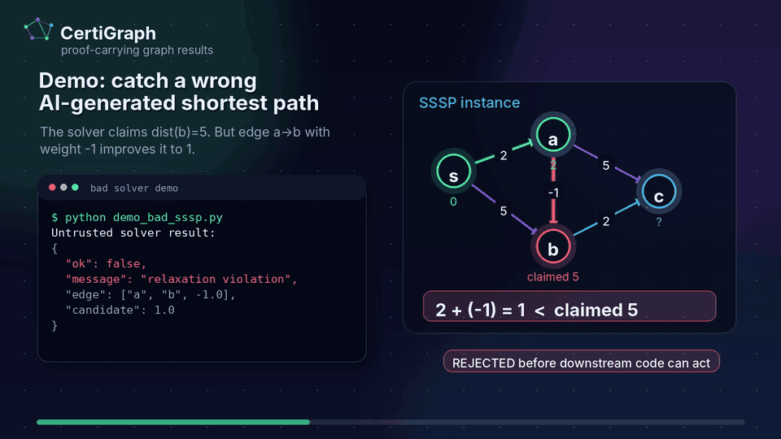
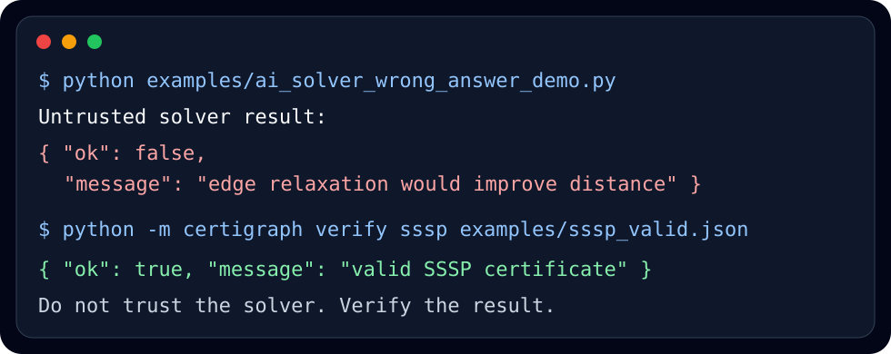

<p align="center">
  
</p>

<p align="center">
  <strong>Proof-carrying graph results for untrusted, optimized, distributed, and AI-generated solvers.</strong>
</p>

<p align="center">
  
  <a href="LICENSE"></a>
  
  
</p>

---

**CertiGraph** is a tiny Python toolkit for a very practical idea:

> Let any solver compute the answer. Make the answer carry a certificate. Trust only a small checker.

That solver can be hand-written, heavily optimized, distributed, GPU-backed, or generated by an LLM. CertiGraph checks the *result*, not the charisma of the program that produced it.


<p align="center">
  <a href="docs/assets/certigraph-demo.mp4">
    
  </a>
</p>

<p align="center">
  <strong>57-second video demo:</strong> catch a wrong AI-generated shortest-path answer, then verify a valid certificate.
  <br>
  <a href="docs/assets/certigraph-demo.mp4">MP4</a> ·
  <a href="docs/assets/certigraph-demo.srt">captions</a> ·
  <a href="docs/video-demo.md">storyboard</a>
</p>

<p align="center">
  
</p>

## Why people should care

Modern software increasingly delegates computation to systems that are hard to audit line by line: AI agents, distributed pipelines, vendor APIs, optimizer services, scientific workflows, and fast native extensions. For many graph problems, the correct response is not “trust me”; it is “here is a witness you can verify cheaply.”

CertiGraph makes that pattern concrete on familiar graph problems:

| Problem | Claimed result | Certificate | What the checker verifies |
|---|---|---|---|
| Single-source shortest paths | distances | parent edge per reachable vertex | every claimed path exists and no edge relaxation can improve it |
| Minimum spanning forest | selected edge indices | the forest itself | it spans each component and satisfies cycle optimality |
| Maximum flow | edge flows | flow plus an s-t cut | feasible flow and equal-value cut certify optimality |
| Topological order | vertex order | the order | every directed edge goes forward |
| Bipartition | vertex colors | the coloring | every edge crosses the partition |
| Connected components | component label per vertex | the labeling | labels match graph connectivity exactly |

Runtime dependencies: **zero**. The producers are included for demos, but the important artifact is the verifier layer.

## Install

From PyPI after the first package release:

```bash
pip install certigraph
```

From source today:

```bash
git clone https://github.com/Gianeh/certigraph.git
cd certigraph
python -m pip install -e .
python -m unittest discover -v
```

## 60-second demo

From a repository clone, verify a valid shortest-path certificate:

```bash
python -m certigraph verify sssp examples/sssp_valid.json
```

Output:

```json
{
  "details": {
    "edges": 5,
    "reachable": 4,
    "vertices": 5
  },
  "message": "valid SSSP certificate",
  "ok": true
}
```

Now watch CertiGraph reject a plausible but wrong answer:

```bash
python examples/ai_solver_wrong_answer_demo.py
```

The demo simulates an untrusted “AI solver” that returns a bad shortest-path distance. CertiGraph rejects the bad result and accepts the independently produced certificate.

## Programmatic use

```python
from certigraph import bellman_ford_certificate, check_sssp_certificate

vertices = ["s", "a", "b", "c"]
edges = [
    ("s", "a", 2),
    ("s", "b", 5),
    ("a", "b", -1),
    ("b", "c", 2),
    ("a", "c", 5),
]

distance, parent = bellman_ford_certificate(vertices, edges, "s")
result = check_sssp_certificate(vertices, edges, "s", distance, parent)
assert result.ok, result.message
```

Canonical hashing for reproducible certificates:

```bash
python -m certigraph hash examples/sssp_valid.json
python -m certigraph hash examples/sssp_valid.json --envelope-kind sssp
```

NetworkX end-to-end examples:

```bash
python examples/networkx_adapter_demo.py
python examples/networkx_components_demo.py
```

## Repository map

```text
certigraph/verify.py          independent checkers: the small trusted core
certigraph/produce.py         reference producers for examples and tests
certigraph/envelope.py        canonical JSON digests and lightweight envelopes
certigraph/adapters/          optional integration helpers
examples/                     JSON certificates and runnable demos
schemas/                      draft JSON Schemas for certificate formats
tests/                        unit, tampering, CLI, and randomized regression tests
docs/                         GitHub Pages-ready documentation, visual demos, and video demo
.github/                      CI, issue templates, PR template, Dependabot
LAUNCH_KIT.md                 copy/paste launch plan for GitHub, HN, X, LinkedIn
```

## Design principle

CertiGraph intentionally separates roles:

```text
producer: may be huge, fast, clever, stochastic, remote, or untrusted
checker:  small, deterministic, boring, auditable
```

For production or high-stakes use, treat only the checker as the trusted computing base. A hardened deployment should use exact numeric domains where possible, freeze certificate formats, fuzz the checkers, attach instance hashes, and eventually formally verify the checker.

## What would make this project big

The near-term goal is not to replace graph libraries. The goal is to become the small verification layer people can add next to graph libraries, solver services, LLM agents, and data pipelines.

High-impact contribution paths:

1. Add more checkers: SCC condensation, bipartite matching, min-cost flow, dominator trees, graph coloring witnesses, SAT/SMT-style adapters.
2. Add formal models: Lean, Coq, Isabelle, Dafny, or Rust verification of the trusted core.
3. Add integrations: NetworkX, rustworkx, OR-Tools, cuGraph, Spark/GraphX, workflow engines.
4. Add certificate corpora: real routing, build-system, supply-chain, compiler, and infrastructure graphs.
5. Add adversarial tests: malformed JSON, pathological floats, parallel edges, disconnected graphs, large sparse graphs.

Start with [`CONTRIBUTING.md`](CONTRIBUTING.md) and [`ROADMAP.md`](ROADMAP.md).

## Research lineage

CertiGraph is inspired by certifying algorithms and proof-carrying code/data: produce a result plus a witness, then verify the witness with a small checker. See [`docs/research.md`](docs/research.md) for references and the proof sketches behind each checker.

## Citation

If CertiGraph helps your research or teaching, cite it using [`CITATION.cff`](CITATION.cff).

## License

MIT. See [`LICENSE`](LICENSE).
