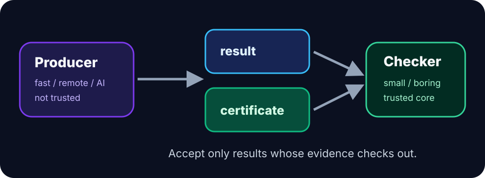

# CertiGraph

<p align="center">
  
</p>

CertiGraph is a small toolkit for **proof-carrying graph results**. A producer emits an answer plus a certificate; a tiny checker accepts or rejects the result.

The main use case is not replacing graph libraries. The main use case is verifying outputs from systems you do not want to trust blindly: AI-generated solvers, remote optimization services, distributed jobs, high-performance native code, or scientific pipelines.


## Video demo

<video controls width="100%" poster="assets/certigraph-demo-thumbnail.png">
  <source src="assets/certigraph-demo.mp4" type="video/mp4">
</video>

The 57-second demo catches a wrong AI-generated shortest-path answer, then verifies a valid certificate. See [`Video demo`](video-demo.md) for the storyboard, teaser GIF, thumbnail, and captions.

## The contract

```text
instance + claimed result + certificate -> checker -> accept / reject
```

The checker is deliberately small and boring. That makes it easier to audit, port, fuzz, and formally verify.

## Supported checkers

| Checker | Certificate | Verification idea |
|---|---|---|
| SSSP | distances + parent edges | parent paths give upper bounds; edge inequalities give lower bounds |
| MSF/MST | selected edge indices | forest spans; cycle optimality rejects cheaper replacements |
| Max flow | flow + s-t cut | feasible flow equals feasible cut capacity |
| Topological order | order | every directed edge points forward |
| Bipartition | coloring | every edge crosses colors |
| Connected components | component labels | labels match connectivity exactly |

## One-minute start

Install the package once it is published:

```bash
python -m pip install certigraph
```

To run the bundled examples from a repository clone:

```bash
git clone https://github.com/Gianeh/certigraph.git
cd certigraph
python -m pip install -e .
python -m certigraph verify sssp examples/sssp_valid.json
```

## Why this is useful

A solver can be wrong for many reasons: bugs, race conditions, stale caches, numerical instability, malformed prompts, adversarial inputs, or silent API changes. CertiGraph turns many graph results into small proofs that downstream systems can check before acting.
